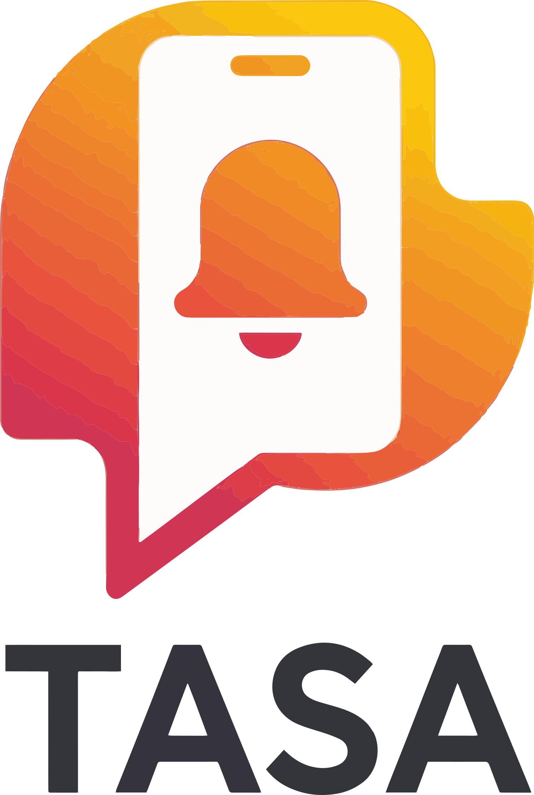

<h1 align="center">
   
  
   
   TASA - Theater Auto Silence App 
</h1>

&nbsp;

<h4 align="center">Mobile app that silences your phone based on location or scheduled events.</h4>
<space></space>
TASA – Theater Auto Silence App is an Android mobile application developed to manage automatic silencing of the device based on user-defined conditions such as geographic location or scheduled calendar events.

The application triggers silencing based on predefined rules, either when the user enters specific locations or during scheduled events such as meetings, lectures, or cultural activities.
